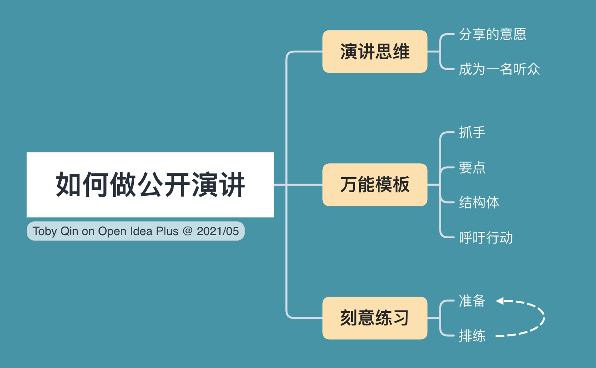

最近做了一个如果做好公开演讲的演讲，理由总结了几个点罗列一下。

## 演讲思维

演讲思维核心要解决的是自己的问题和别人的问题。

### 自己的问题

我是谁，我为什么来做这个演讲？我想要达到什么样的目的。

对于我来说，我做演讲通常可以用两个原因来解释。其一，公开的演讲可以锻炼我的逻辑思维能力，语言组织能力和沟通表达能力。其二，我希望通过公开的演讲或者分享来让自己更深刻地掌握一种知识，知识的习得有三个层次，理解知识，运用知识，分享知识。在公开分享之后可能达到一个很深刻的程度。

解决完自己的问题后，我们来解决别人的问题。

### 别人的问题

听众是谁，为什么来听你的演讲？他们希望获得什么。

作为演讲者要深刻去理解听众的痛点，换位思考，有同理心。越是在重要的场合这样的思考要做的越多，可以找一些核心听众去做访谈，看看他们想要什么，期望是什么样子的。

早点做准备拿到第一手反馈，惊喜不是通过保密来得到的，而是通过反复改进得到的。

## 演讲模板

这个万能的演讲模板来自于《即兴演讲》这本书，很容易套用。

### 抓手

意味着你需要有一个不错的切入点，能吸引到听众的注意力，可能是一些拉近距离的寒暄，或者吊人胃口的问题，亦或者一个小故事，能抓住听众就对了。

### 要点

演讲的时间是比较短的，要开门见山，当抓住听众后，就要有足够分量的观点让他们继续听下去，所以说重点。

### 结构体

